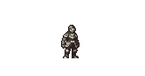

# Sprite Animation

Inicia com o boneco em descanço

Seta para esquerda = Personagem anda para esquerda

Seta para direita = Personagem anda para direita

Seta para Z = Personagem faz o ataque 1

Seta para x = Personagem faz o ataque 2

